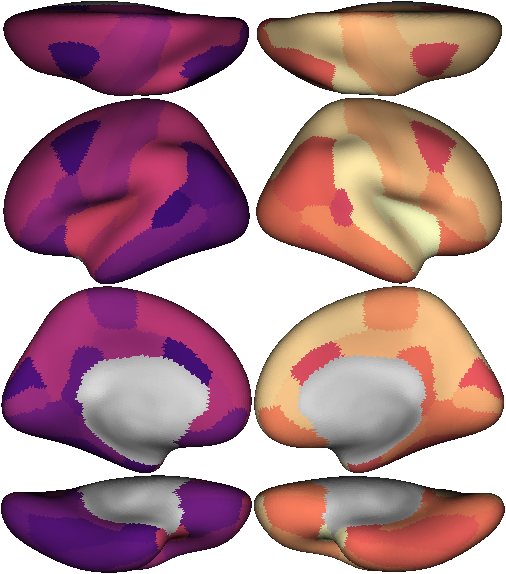
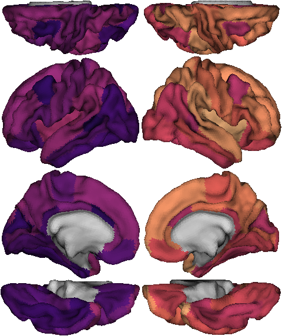

# brainmontageplot

Generate brain surface ROI figures multiple viewpoints and combine them together. Can be used from command line.

Requirements: python3, nilearn (for main plotting functions), numpy, scipy, nibabel, PIL, pandas

[atlas_info.json](atlas_info.json) contains information about the currently supported atlases to map ROIs to surface vertices.
* fs86: FreeSurfer Desikan-Killiany 68 cortical gyri + 18 aseg subcortical. **Currently the only supported atlas**

Usage:
```
python brainmontage.py 
--input INPUTFILE                  file with value for each ROI. Can be .txt or .mat
[--inputfield INPUTFIELDNAME]      for .mat input with multiple variables, which variable name to use
--views VIEWNAME VIEWNAME ...      choose from: dorsal, lateral, medial, ventral. default: all
--outputimage OUTPUTIMAGE          image file to save final montage
--surftype SURFTYPE                choose from: infl, white, pial. default: infl
--colormap CMAPNAME                colormap name from matplotlib colormaps
--clim MIN MAX                     colormap value range
[--noshading]                      don't apply surface lighting
# atlas info option 1:
[--atlasname ATLASNAME]            atlas name for entry in atlas_info.json
# atlas info option 2:
[--roilut ROILUTFILE]              if not providing atlasname, must provide roilut, lhannot, rhannot files
[--lhannot LHANNOTFILE]
[--rhannot RHANNOTFILE]
[--annotsurfacename ANNOTSURFACE]  surface on which annot files are defined (default:fsaverage5)
[--lhannotprefix LHANNOTPREFIX]    prefix to append to names in lhannot to match ROI LUT (eg: ctx-lh-)
[--rhannotprefix RHANNOTPREFIX]         same for rhannot (eg: ctx-rh-)
```

Example command-line usage:
```
python brainmontage.py --input mydata_fs86.mat --inputfield data --atlasname fs86 --outputimage mydata_montage.png --colormap magma --clim -1 1
```

Example python function usage:
```python
import numpy as np
from brainmontage import create_montage_figure

roivals=np.arange(86) #example values for each ROI

img=create_montage_figure(roivals,atlasname='fs86',
    viewnames='all',surftype='infl',clim=[0,86],colormap='magma')

from PIL import Image
Image.fromarray(img).save('mydata_montage.png')
#or you can add outputimagefile='mydata_montage.png' to create_montage_figure() to save directly
```
 
