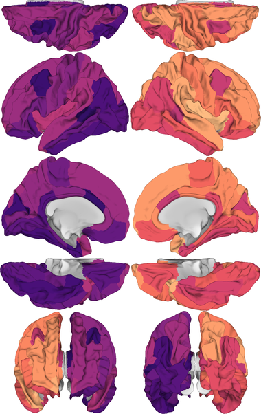

# brainmontageplot

Generate brain ROI figures with multiple surface viewpoints and/or volume slices and combine them together. Can be used from command line.

[](https://colab.research.google.com/github/kjamison/brainmontageplot/blob/main/brainmontageplot_example.ipynb) (Note: non-lookup rendering is much faster on local install than colab)

Requirements: python3 (<3.11 for now!), nilearn (for main plotting functions), numpy, scipy, nibabel, PIL, pandas. See [requirements.txt](requirements.txt)

[atlas_info.json](brainmontage/atlases/atlas_info.json) contains information about the currently supported atlases to map ROIs to surface vertices.
* fs86: FreeSurfer Desikan-Killiany 68 cortical gyri + 18 aseg subcortical.
* fs86med: Same as fs86, but it projects all of the subcortical structures (except cerebellum) onto the medial wall. See [example](examples/mydata_fs86sub_montage.png)
* shen268: 268-region cortical+subcortical atlas from [Shen 2013](https://pubmed.ncbi.nlm.nih.gov/23747961/)
* schaefer100(200,300,400,800): 100-400,800 region cortical atlas from [Schaefer 2018](https://pubmed.ncbi.nlm.nih.gov/28981612/). Uses 7Network order.
* hcpmmp: 360 region cortical atlas from [Glasser 2016](https://pubmed.ncbi.nlm.nih.gov/27437579/)
* coco439: 81 subcortical regions + 360 region cortical atlas from [Glasser 2016](https://pubmed.ncbi.nlm.nih.gov/27437579/)
* cifti91k: Renders 32k_fs_LR data (91282 values = 29696 L verts + 29716 R verts + 31870 subcort voxels), e.g., from HCP pipelines

Installation:
```
git clone https://github.com/kjamison/brainmontageplot.git
cd brainmontageplot
pip install .
```


Usage:
```
brainmontage 
[--input INPUTFILE]                 file with value for each ROI. Can be .txt or .mat
[--inputfield INPUTFIELDNAME]       for .mat input with multiple variables, which variable name to use
[--inputvals val1 val2 val3 ...]    provide values for each ROI directly from commmand line
--views VIEWNAME VIEWNAME ...       choose from: dorsal, lateral, medial, ventral, anterior, posterior (or none). default: all
--outputimage OUTPUTIMAGE           image file to save final montage
--surftype SURFTYPE                 choose from: infl, white, pial, mid, semi (semi-inflated). default: infl
--colormap CMAPNAME                 colormap name from matplotlib colormaps (or "lut" for RGB from atlas LUT)
[--cmapfile CMAPFILE]               .txt file with R,G,B values on each line for some colormap 
--clim MIN MAX                      colormap value range
--upscale SCALE                     higher value to render images at higher resolution (default=1)
--backgroundcolor COLORNAME         color name for background (default: white)
[--backgroundrgb R G B]               or specify background as R G B triplet (values 0-1.0)
[--noshading]                       don't apply surface lighting
--facemode <[mode],mean,best>       face color mode: mode (default, fastest), mean, best (prettier)
--bestmodeiters                     For "best" facemode, how many selection smoothing iterations (default=5)

#color bar options
--colorbar                          Add colorbar to output image
--colorbarcolor COLORNAME           Colorbar tick+label color. Can change to "white" for dark backgrounds
--colorbarfontsize FONTSIZE         Font size for colorbar label values
--colorbarlocation LOCATION         right (default), left, top, bottom
--colorbartext LABEL                Text for colorbar label
--colorbartextrotation              Flip colorbar label 180deg

#optional volume slices
--slices <ax,cor,sag> <slice idx>   List of slice axes names followed by and indices
                                     * Example: axial slices 10,20,30 and sagittal 5,10,15: 
                                        --slices ax 10 20 30 sag 5 10 15
                                     * order of axes determines order they appear in final montage
--axmosaic ROWS COLS                How many rows and columns for axial, coronal, or sagittal volume slices?
--cormosaic ROWS COLS                * default = square. 
--sagmosaic ROWS COLS                * One of ROWS or COLS can be -1
--stackdir <[horizontal],vertical>  should slice mosaics be stacked horizontal or vertical (surface views always vertical)
--slicebgalpha ALPHAVAL             opacity value for brain slice background volume (default=1)
--slicezoom ZOOMVAL                 Zoom (and crop) volume slices (range >=1. default=1)

# atlas info option 1:
[--atlasname ATLASNAME]             atlas name for entry in atlas_info.json

# atlas info option 2:
[--roilut ROILUTFILE]               if not providing atlasname, must provide roilut, lhannot, rhannot files
[--lhannot LHANNOTFILE]
[--rhannot RHANNOTFILE]
[--annotsurfacename ANNOTSURFACE]   surface on which annot files are defined (default:fsaverage5)
[--lhannotprefix LHANNOTPREFIX]     prefix to append to names in lhannot to match ROI LUT (eg: ctx-lh-)
[--rhannotprefix RHANNOTPREFIX]             same for rhannot (eg: ctx-rh-)
[--subcortvolume SUBCORTVOL]        NIfTI volume with subcortical ROIs
```

Example command-line usage: Surface views
```
brainmontage --input examples/mydata_fs86.mat --inputfield data --atlasname fs86 \
    --colormap magma --clim -1 1 --outputimage mydata_montage.png
```

Example command-line usage: Surface views with column of axial slices
```
brainmontage --input examples/mydata_fs86.mat --inputfield data --atlasname fs86 \
    --colormap magma --clim -1 1 --slices ax 23 33 43 53 --axmosaic -1 1 \
    --outputimage mydata_montage_withslices.png 
```

Example command-line usage: Surface views with LUT ROI colors
```
brainmontage --atlasname fs86med --colormap lut \
    --outputimage mydata_fs86med_lut_montage.png
```

Example python function usage:
```python
import numpy as np
from brainmontage import create_montage_figure, save_image

#note: any ROIs with "nan" will not be displayed

roivals=np.arange(86)+1 #example values for each ROI (1-numroi)

img=create_montage_figure(roivals,atlasname='fs86',
    viewnames='all',surftype='infl',clim=[0,86],colormap='magma')

save_image(img,'mydata_montage.png')
#or you can add outputimagefile='mydata_montage.png' to create_montage_figure() to save directly

#create an image with surface views, upscaled by 2, a vertical row of axial slices, 
# with black background, using smoother "best" face-coloring mode
img_with_slices=create_montage_figure(roivals,atlasname='fs86',
    viewnames='all',surftype='infl',clim=[0,86],colormap='magma',
    slice_dict={'axial':[23,33,43,53]},mosaic_dict={'axial':[-1,1]},
    upscale_factor=2, backgroundcolor="black", face_mode="best",
    outputimagefile='mydata_montage_withslices.png')

#create an image with surface views, upscaled by 2, with a colorbar
img_with_slices=create_montage_figure(roivals,atlasname='fs86',
    viewnames='all',surftype='infl',clim=[0,86],colormap='magma',
    upscale_factor=2, face_mode="best", add_colorbar=True, colorbar_label='my data',
    outputimagefile='mydata_montage_withcolorbar.png')

#Or an image with axial, coronal, and sagittal slices only, and a light gray background
img_slices=create_montage_figure(roivals,atlasname='fs86',
    viewnames='none',clim=[0,86],colormap='rainbow',
    slice_dict={'axial':range(0,180,20),'coronal':range(20,200,20),'sagittal':range(10,180,20)},
    backgroundcolor="lightgray",
    outputimagefile='mydata_montage_onlyslices.png')

```
      
